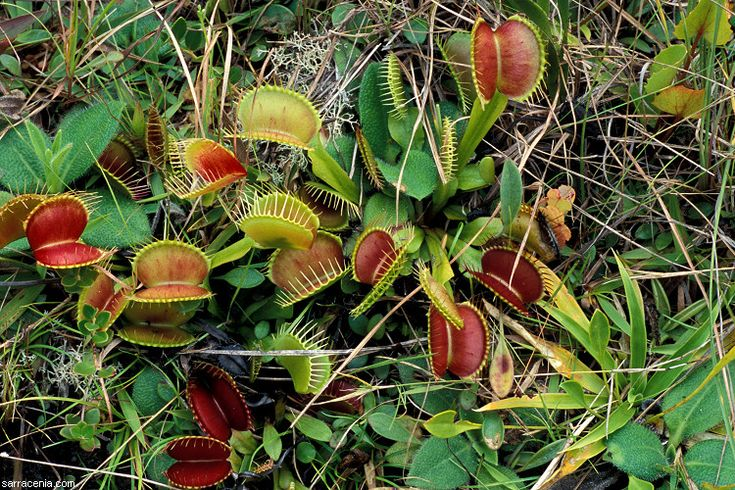

# How to Grow Flytrap
Venus flytrap is an interesting plant. Compared with other plants, it can not only move, but also prey on insects and obtain nutrients. But this plant is cared for differently than others, and this article will cover some key points to help grow this amazing carnivorous plant.
## Materials
- A Flytrap with pot
    >you can easily buy one from local market or online!

## Steps
1. Place your flytrap in a place with plenty sunshine
    >flytrap loves sunlight. Give them sunlight as much as you can. 6~8 hours per day would be ideal. Without enough sunlight, your flytrap could get weak and eventually die.
        >
2. Use rainwater or distilled water. 
    >Tap water is usually too contains too many minerals for flytrap
        >
3. Keep the soil moist. 
    > Venus flytrap grows in the marshes of Virginia, so the soil is 
    usually moist all year round.
        >
4. Do not use any fertilizers. 
    > Also because Venus flytrap grows naturally and in swamps, the surrounding soil environment is often very poor. Fertilizing will destroy the root of the Venus flytrap. Don't worry, just put it outside and it will feed itself from the poor fly
        >
5. Keep the Venus flytrap in a cold place during the winter. 
    > Unlike common houseplants, Venus flytrap needs to go dormant during the winter. Although Venus flytrap is a hardy plant and can withstand temperatures below 0 degrees, it is best to keep it in a 2 to 10 °C environment. Even though it looks like it's dead, don't worry. When spring comes, it will grow again.
        >

